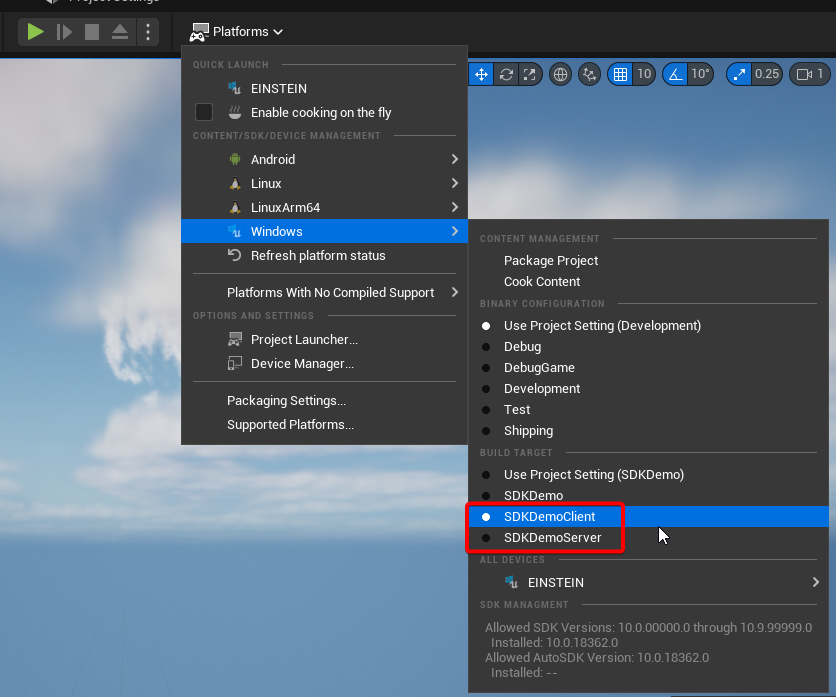
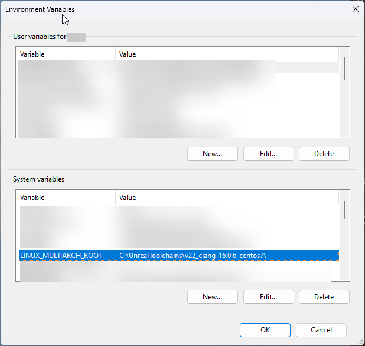
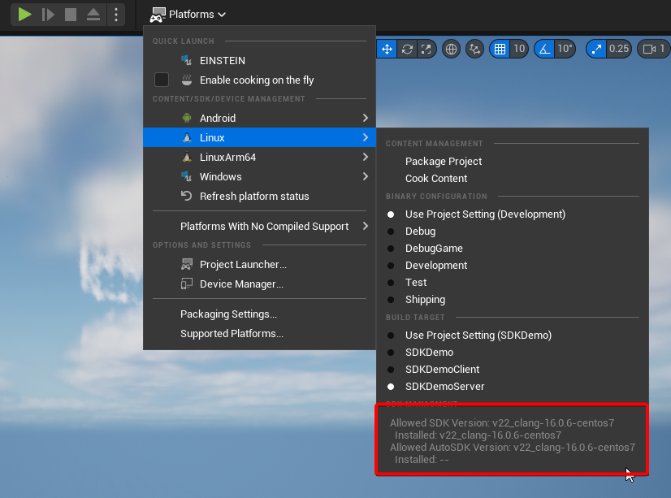
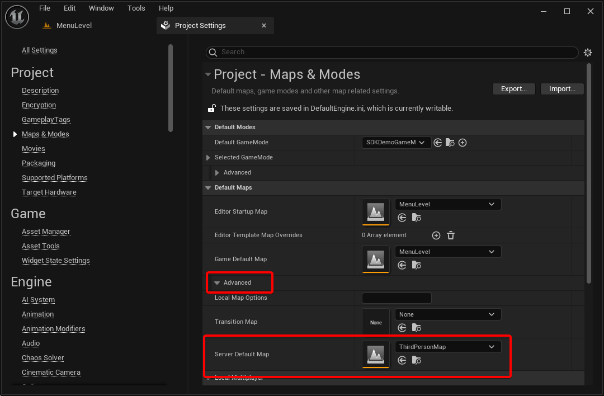
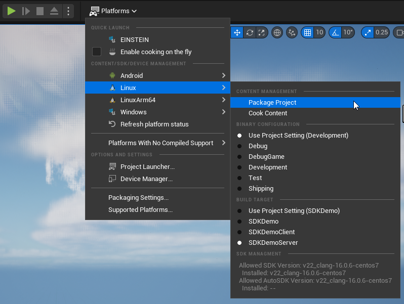
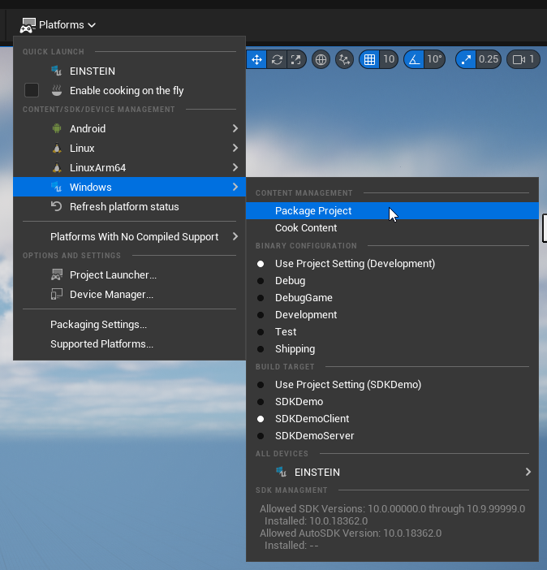
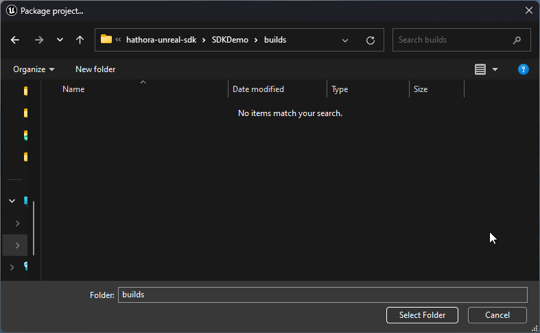

# Hathora Unreal Engine 5 Cloud SDK (and Demo)

This repository includes the source code for the [Hathora SDK plugin](./SDKDemo/Plugins/HathoraSDK) for Unreal Engine 5 as well as an Unreal project that provides examples on how to use the SDK plugin.

This README covers:
- [SDK Plugin Usage](#sdk-plugin-usage)
- [Lobby Example](#lobby-example)
- [Packaging Server and Client Builds and creating a Hathora deployment](#packaging)
- [Development Setup](#development-setup)
- [Development code Formatting and style](#code-formatting-and-style)

## SDK Plugin Usage

The SDK supports most Hathora Cloud API endpoints, which you can [call manually](#manually-calling-api-endpoints). The SDK also provides an easy interface to automatically fetch and ping all available Hathora Cloud regions with the [Get Regional Pings](#get-regional-pings) function.

### Get Regional Pings

This function takes an optional second argument `int32 NumPingsPerRegion` which defaults to `3`. The SDK will execute the following when calling this function:
1. Call the `GetPingServiceEndpoints` API call
2. Send an ICMP echo for each region once in parallel
3. After receiving a result for **each** region, step 2 is repeated `NumPingsPerRegion - 1` times. The SDK waits until a result is returned from each region before sending another set of pings to prevent some of the ICMP echos from being ignored/dropped due to subsequent/overlap requests.
4. After running step 2 a total of `NumPingsPerRegion` times, the minimum is returned for each region. If a particular region timed out or was unreachable otherwise for each ping, it is omitted from the callback delegate.

The ICMP pings have a default timeout of `1.0 seconds`; you can change this in the `Edit > Project Settings... > Plugins submenu > Hathora SDK` menu (or just search for `ping timeout`):


If you want to save the change for your entire project/team, make sure to click the **Set as Default** button at the top; this will save the setting in `Config/DefaultGame.ini` which you can add to your version control. If you don't do this, the setting will only apply to your instance of the Unreal project.

If you [manually call](#manually-calling-api-endpoints) `GetPingServiceEndpoints()`, you will need to execute the ICMP echos yourself. You can see an example of this in [HathoraSDKDiscoveryV1.cpp](./SDKDemo/Plugins/HathoraSDK/Source/HathoraSDK/Private/HathoraSDKDiscoveryV1.cpp#L94-L97).

#### C++

To call `GetRegionalPings` with C++, you should use the `UHathoraSDK::GetRegionalPings(...)` static function. You can find an example of how to use this in [DemoMenuWidget.cpp](./SDKDemo/Source/SDKDemo/DemoMenuWidget.cpp#L93-L95).

#### Blueprint

To call `GetRegionalPings` with BP, you should use the `Get Regional Pings` BP node found under the `Hathora SDK` category:


Here is an example of using that node:


### Manually calling API endpoints

The SDK provides functions that provide access to the Hathora Cloud API endpoints. You can find a list of the supported endpoints [below](#supported-cloud-api-endpoints).

#### C++

To create an instance of `UHathoraSDK`, call the static `UHathoraSDK::CreateHathoraSDK` function:

``` c++
// Below is an example on how to instantiate the SDK. The AppId and DevToken
// are automatically retrieved from the Project Settings / Game.ini
UHathoraSDK* SDK = UHathoraSDK::CreateHathoraSDK();
```

From there, you can get access to the supported API calls (e.g. `GetPingServiceEndpoints`) function via the respective `UHathoraSDK` property (e.g. `DiscoveryV1`):

``` c++
FHathoraOnGetPingServiceEndpoints OnGetEndpointsComplete;
OnGetEndpointsComplete.BindUFunction(this, TEXT("YourCallback")); // assumes this is a UObject
SDK->DiscoveryV1->GetPingServiceEndpoints(OnGetEndpointsComplete);
```

All API calls have an `OnComplete` delegate callback like `OnGetEndpointsComplete` in the above example; make sure the function you provide (e.g. `UYourClass::YourCallback`) has the matching signature (e.g. `void (const TArray<FHathoraDiscoveredPingEndpoint>& PingEndpoints)`). You can find the appropriate signature in the respective `Plugins/HathoraSDK/Source/HathoraSDK/Public/HathoraSDK<API>.h` file (e.g [HathoraSDKDiscoveryV1.h](./SDKDemo/Plugins/HathoraSDK/Source/HathoraSDK/Public/HathoraSDKDiscoveryV1.h)).

You can also use C++ lambdas:

``` c++
FHathoraOnGetPingServiceEndpoints OnGetEndpointsComplete;
OnGetEndpointsComplete.BindUFunction(this, TEXT("YourCallback"));
SDK->DiscoveryV1->GetPingServiceEndpoints(
  UHathoraSDKDiscoveryV1::FHathoraOnGetPingServiceEndpoints::CreateLambda(
    [this](const TArray<FHathoraDiscoveredPingEndpoint>& Endpoints)
    {
      // handle the response here
    }
  )
);
```

#### Blueprint

To create an instance of `UHathoraSDK`, call the `Create Hathora SDK` BP node. There's no need to provide an AppID or the Hathora Dev Token, so those are left blank in the call (but can be provided if you need them to access other APIs). From there, you can find API endpoint function nodes (e.g. `Get Ping Service Endpoints`) on the respective variable (e.g. `DiscoveryV1`):


## Lobby Example

The sample project provides a complete example of using the Hathora Lobby service, including:
- Client menu to create and join lobbies with a custom `roomConfig`, which also shows corresponding region ping results
  - See `Content/W_Lobby` which uses `Content/B_LobbyComponent` as an easy to use interface to the SDK
- Server code to fetch, update, and replicate the `roomConfig` and `shortCode`
  - See `Content/ThirdPerson/Blueprints/B_MatchGameState`
- Client facing HUD to display the in-match replicated `roomConfig` and `shortCode`
  - See `Content/ThirdPerson/Blueprints/W_MatchHUD`

## Packaging

There are several steps necessary before you're able to package the correct builds:
- [Compiling Unreal from source](#unreal-source-build)
- [Adding Server and Client targets](#preparing-build-targets)
- [Compiling a Linux server](#linux-cross-compilation)
- [Setting up default maps](#default-maps)
- [Packaging the builds](#packaging-the-builds)

### Unreal Source Build

To be able to package a Dedicated Server build, you need to compile Unreal Engine from source. You can find a complete [guide from Epic](https://docs.unrealengine.com/5.3/en-US/building-unreal-engine-from-source/) on how to do this.

Once you have successfully compiled Unreal Engine from source, you can [convert](https://docs.unrealengine.com/5.3/en-US/updating-projects-to-newer-versions-of-unreal-engine/) your project to the source version. You can also optionally Right Click on the `uproject` file, select `Switch Unreal Engine version...` (under `Show more options` for Windows 11), and pick the corresponding "Source build...". This will generate a new Visual Studio project file which you'll be able to open and compile your project again.

### Preparing Build Targets

Packaging your project for Hathora will require you to package a Dedicated Server build and a Client build. Your client build could include server logic if you're supporting peer-to-peer hosted servers, but this documentation will assume you'll be using a Client target that excludes the server logic.

To be able to add Server and Client build targets, you'll need to add a `.Target.cs` file for each in your `Source` directory. See [SDKDemoServer.Target.cs](./SDKDemo/Source/SDKDemoServer.Target.cs) and [SDKDemoClient.Target.cs](./SDKDemo/Source/SDKDemoClient.Target.cs) in this sample project as a reference. Mainly, you're just changing `Type` to `TargetType.Server` and `TargetType.Client` respectively. Make sure regenerate your project files after doing this (Right Click on the `uproject` file and select `Generate Visual Studio project files` (under `Show more options` for Windows 11)). Recompile and launch the editor; you should now see Server and Client targets available in the Platforms dropdown in the editor:



### Linux Cross Compilation

Hathora Cloud servers run on Linux, so you must compile the Server target for Linux. You can either build on a Linux machine or you can cross-compile for Linux on a Windows machine. See Epic's [guide on setting up cross-compilation](https://docs.unrealengine.com/5.3/en-US/linux-development-requirements-for-unreal-engine/#cross-compiletoolchain). If you're compiling on a Linux machine, you'll need the Native Toolchain; if you're compiling on a Windows machine for Linux, you'll need the Cross-Compile Toolchain. Cross-compiling for Linux on Mac is not currently supported by Epic.

If cross-compiling, you may need to set the `LINUX_MULTIARCH_ROOT` environment variable to point to your Toolchain install. You will need to restart the editor, and even maybe Visual Studio for the environment variable to take effect. Here is an example of the UE 5.3 toolchain being used in an environment variable on Windows:



You'll know if you have set up cross-compilation correctly once you see under the Linux submenu under Platforms that the Installed SDK version matches the Allowed one:



### Default Maps

You're likely familiar with setting a default map for when an Unreal game starts under `Project Settings > Maps & Modes`, but now that we have two separate targets we need to make sure the Client target opens the main menu and the Server target opens the match map. Under the `Project Settings > Maps & Modes`, there is a `Server Default Map` setting under `Advanced` which will get loaded instead of the `Game Default Map` for the Server build:



The Client build will open the `Game Default Map` option.

### Packaging the Builds

Now that you have Linux cross-compilation set up on a source build of Unreal with Server and Client targets opening the correct maps on startup, you're ready to package the builds. While you can create scripts to do automate this process, you can easily build the two targets under the Platforms menu in the Editor. Once you have selected the correct target and build configuration, you can select `Package Project`. In the below images, you'll see we're packaging a Linux Server (Development) and a Windows Client (Development):





When selecting `Package Project`, you'll be prompted to select a folder. This can go anywhere, but we're selecting a new `builds` folder in our Unreal project folder which we have prepared a script to help us create the Deployment for Hathora:



This will create `LinuxServer` and `WindowsClient` folders in the directory we selected. You can distribute `WindowsClient` however you plan to your players, but to prepare `LinuxServer` for Hathora, you need to create a tarball with a `Dockerfile` and the contents of that.

We have provided a sample [Dockerfile](./SDKDemo/Dockerfile) and a script [prepare-deployment.sh](./SDKDemo/prepare-deployment.sh) that work with this sample project. You will need to adjust both for your project. In the `Dockerfile`, make sure that the paths are correct (i.e. look for `SDKDemo`, `SDKDemoServer`, and `./builds/LinuxServer`). Note that if you're building for anything other than `Development` configuration, the path to the binary changes to include a suffix (i.e. `SDKDemoServer-Linux-Shipping`). The `prepare-deployment.sh` script works in a Git Bash terminal environment on Windows.

Ultimately, you need to create a gzipped tarball that has a `Dockerfile` in the root folder that prepares the server properly. If you have any questions about this step, reach out on our [Discord server](https://discord.gg/hathora).

## Supported Cloud API Endpoints

- AuthV1
  - LoginAnonymous
  - LoginNickname
  - LoginGoogle
- DiscoveryV1
  - GetPingServiceEndpoints (helper function `Get Regional Pings` will call this and execute multiple pings for you, providing the minimum)
- LobbyV3
  - CreateLobby
  - ListActivePublicLobbies
  - GetLobbyInfoByRoomId
  - GetLobbyInfoByShortCode
- ProcessesV1
  - GetRunningProcesses
  - GetStoppedProcesses
  - GetProcessInfo
- RoomV2
  - CreateRoom
  - GetRoomInfo
  - GetActiveRoomsForProcess
  - GetInactiveRoomsForProcess
  - DestroyRoom
  - SuspendRoom
  - GetConnectionInfo
  - UpdateRoomConfig

## Development Setup

### macOS

#### Install stuff

1. Install Xcode. You will likely need Xcode 14, which only runs on macOS 13 (Ventura). You can find the current release at the [Apple Developer site](https://developer.apple.com/download/all).
1. After installing Xcode, open it once to accept the license agreements and install the macOS SDKs. After this you can close it.
1. Install the [Epic Games Launcher](https://store.epicgames.com/en-US/download). After installation open the Launcher and login with an Epic Games account.
1. Install Unreal Engine 5.2. [This link](com.epicgames.launcher://ue) should open the Epic Games Launcher to the correct screen once you've logged in.
1. _Optional Validation Step_ After installation, attempt to open the Unreal Editor (in your applications folder). If it fails to open, things are not working correctly. Next, create a "blank" C++ game project and stick it wherever on your hard drive. When you click "Create," you should eventually have Xcode and the editor open up. If you receive a message that "your project did not compile," double check that Xcode is installed, you have the right version, and that it is located in your Applications folder (e.g. that you didn't leave it in Downloads or something).

### Windows 10

1. Install the Epic Games Launcher and Unreal Engine 5.2. The installer for Unreal Engine should ensure you have all of the required tools.

### Open project / Run demo
Open the project in your IDE of choice. Xcode (macOS), Visual Studio (Windows), and JetBrains Rider (cross-platform) will work out of the box. You
likely can get decent VSCode setup by following the instructions in [this documentation page](https://docs.unrealengine.com/5.2/en-US/setting-up-visual-studio-code-for-unreal-engine/).

Your IDE likely has a button for "Run." Click that. The project should open in the Unreal Editor. Once open in the editor, click the green "Play" button to start the (very unstyled/ugly) demo. Click the "GET PINGS" button and the pings will be logged to the console. This is the demo.

### Editor Tips

If you're using Rider, here are some tips:
- You can install the RiderLink plugin when prompted, but you don't have to. It has a bunch of features that won't really help with this project.
- Turn off the tree output view for build errors. Unfortunately this view elides most problems and after a build fails you'll only get a split second before
the error messages disappear. In Preferences, go to `Tool Window: switch to tree view after the build if build events were reported` on the `Build, Execution, Deployment | Toolset and Build | Presentation` and uncheck the box. This is the difference between getting "linker exited with exit code 1" as your only error message versus the actual output of `ld`.

## Code Formatting and Style

See [the Unreal Engine 5 coding standard](https://docs.unrealengine.com/5.2/en-US/epic-cplusplus-coding-standard-for-unreal-engine/) for style guidelines.

There is a `clang-format` file included here for the formatting parts of the UE5 code style.
You can install `clang-format` from Homebrew and run it over all files. This is a command that should work with BSD find (the kind installed on Macs):

```bash
find . -name '*.cpp' -o -name '*.h' -exec clang-format -i {} +
```

You might also be able to find a plugin for your editor that uses `clang-format`.

